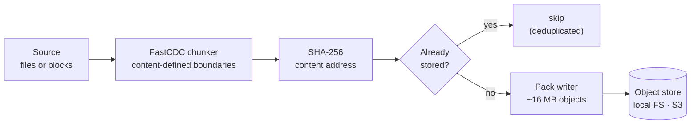

# distbackup

**A content-addressed, deduplicating backup engine written in Go — chunker, storage format, index, and pipeline all built from scratch.**

[](https://github.com/VardaanAggarwal/distbackup/actions/workflows/ci.yml)
[](https://go.dev/)
[](LICENSE)
[](#testing)
[](#testing)

Change one byte in a 20 MB file and back it up again — distbackup stores **101 KiB**, not 20 MB.

---

## See it work

```console
$ distbackup init --repo ./repo
initialised repository at ./repo (format version 1)

$ distbackup backup --repo ./repo --source ./data
snapshot e619a7bd7c57c06d
  files            4
  source bytes     41.8 MiB
  blobs stored     318 (22.7 MiB)
  blobs deduped    266 (19.1 MiB)      ← a duplicate file cost nothing
  dedup ratio      45.7%
  packs written    2
  duration         75ms
```

Now change **a single byte** in the middle of a 20 MB file and run it again:

```console
$ printf 'X' | dd of=data/photos/vacation.tar bs=1 seek=10000000 conv=notrunc

$ distbackup backup --repo ./repo --source ./data
snapshot e64aff8d2209bcda
  files            4
  source bytes     41.8 MiB
  blobs stored     1 (101.3 KiB)       ← one chunk, not one file
  blobs deduped    583 (41.7 MiB)
  dedup ratio      99.8%
  packs written    1
  duration         35ms
```

Two full snapshots of 41.8 MiB each — 83.6 MiB of logical data — occupy **23 MB on disk**.

And it comes back out exactly as it went in:

```console
$ distbackup verify --repo ./repo --full
ok: 2 snapshots, 3 packs, 319 blobs referenced, 319 read, 0 missing packs, 0 dangling blobs, 0 orphan packs

$ distbackup restore --repo ./repo --snapshot latest --target ./restored
restored 4 files (41.8 MiB) from snapshot e64aff8d2209bcda in 48ms

$ diff -r ./data ./restored && echo "identical"
identical
```

---

## Quick start

```bash
go install github.com/VardaanAggarwal/distbackup/cmd/distbackup@latest
```

Or build from source:

```bash
git clone https://github.com/VardaanAggarwal/distbackup
cd distbackup
go build -o distbackup ./cmd/distbackup
```

| Command | What it does |
|---|---|
| `init --repo <path>` | Create a repository |
| `backup --repo <path> --source <dir>` | Back up a directory |
| `snapshots --repo <path>` | List snapshots |
| `restore --repo <path> --snapshot latest --target <dir>` | Restore |
| `verify --repo <path> [--full]` | Check integrity |
| `gc --repo <path> [--dry-run]` | Reclaim unreferenced space |

Useful flags: `--dry-run` measures a backup without writing anything, `--max-bytes` caps how much a run will read.

---

## How it works



The whole design rests on one idea: **address data by the hash of its content, not by where it sits.** Two identical chunks have the same SHA-256, so storing the second is a no-op.

The hard part is deciding where chunks begin and end. Split every 64 KB and inserting one byte at the front shifts every subsequent boundary — nothing matches, and your "incremental" backup rewrites the entire file. **FastCDC** picks boundaries by running a rolling hash over the data itself, so a boundary lands at the same *content* regardless of where that content moved to. An insertion perturbs one chunk; everything after it realigns.

That is what the demo above is showing.

---

## What's interesting in here

**Content-defined chunking, implemented from scratch.** FastCDC over a Gear rolling hash with normalized chunking — two masks rather than one, which pulls the chunk-size distribution toward the target instead of leaving it exponential. Measured: **100%** of boundaries resynchronise after a one-byte insertion, against **0%** for a fixed-size control running the identical measurement.

**A storage format designed for cheap recovery.** Chunks are batched into ~16 MB pack files with the index written at the *end* of the file. That allows a single streaming write pass with bounded memory, and it means a lost index can be rebuilt with one small ranged read per pack instead of re-downloading everything.

**Crash safety by write ordering, not by hoping.** Data, then index, then the manifest that references it — each durable before the next. Every reachable crash state is harmless: orphaned packs (reclaimable), or a stale index (rebuildable), or no snapshot at all. What the ordering makes *impossible* is a snapshot pointing at data that isn't there. Verified by `SIGKILL`ing a real process at randomised points and asserting the repository still verifies.

**A 256-way sharded index with a free shard key.** Blob IDs are SHA-256 digests, which are already uniformly distributed — so the shard selector is just the first byte, no hashing needed. Measured **4× less contention** than a single mutex under parallel load, with observed shard balance matching the Poisson prediction to within 1.5%.

**Storage backends are pluggable, and the compiler enforces it.** The engine defines the interfaces; providers implement them. No core package may import a cloud SDK — that's checked by an architecture test that parses the import graph and fails the build, not by a code-review convention.

Every non-obvious decision in this codebase is recorded in **[docs/DECISIONS.md](docs/DECISIONS.md)** with the alternative that was rejected and why.

---

## Measured results

Apple M1, `darwin/arm64`, Go 1.24.0. Every number here has the command that produced it — nothing is estimated.

### Deduplication

```bash
go test -race -run TestBoundaryShift -v ./internal/chunker/
```

| | Result |
|---|---|
| Boundaries resynchronised after a 1-byte insertion | **100%** (172 / 172) |
| Same measurement, fixed-size chunking | 0% |
| Bytes re-stored after 1-byte edit to an 8 MiB file | **1.0%** |
| Mean chunk size (target 64 KiB) | 72.55 KiB |
| Chunks forced to the size cap | 0% |

### Throughput

```bash
go test -bench=. -benchmem -run='^$' ./internal/...
```

| Benchmark | Throughput |
|---|---:|
| **Full backup pipeline** | **640.6 MB/s** |
| Chunker (chunk + copy) | 1,716.1 MB/s |
| Boundary scan only, 0 allocations | 2,001.4 MB/s |
| Pack write | 1,097.5 MB/s |
| Pack read, single blob | 2,114.4 MB/s |

### Index sharding

```bash
go test -bench=Parallel -benchmem -run='^$' ./internal/index/
```

| Operation | Sharded (256-way) | Single mutex | Speedup |
|---|---:|---:|---:|
| Parallel insert | 79.0 ns/op | 317.4 ns/op | **4.0×** |
| Parallel lookup | 68.5 ns/op | 123.2 ns/op | **1.8×** |

Shard balance over 102,400 entries: mean 400.0, **σ = 20.3** against a Poisson prediction of √400 = 20.0.

> An earlier version of this benchmark reported 513 vs 525 ns/op — i.e. that sharding was pointless. The benchmark was wrong: it hashed keys *inside* the timed loop, so both variants were really measuring SHA-256. Moving that out exposed the real 4× gap. It's kept in the git history as a reminder that a number without its method is not evidence.

---

## Testing

```bash
go test -race ./...     # 9 seconds, fully offline
```

**178 tests, 12 benchmarks, 18 packages, race detector clean.** No test requires a network connection.

Four tests carry the load, and each was verified to actually *fail* against a broken implementation rather than passing vacuously:

| Test | What it proves | Verified by |
|---|---|---|
| Boundary shift | Chunking is content-defined | Fixed-size chunking scores 0% on the same measurement |
| Concurrent dedup | 100 goroutines, exactly one insert wins | Swapping in read-lock-then-upgrade fails it within 3 rounds |
| Round trip | Restored bytes are identical | — |
| Crash | `SIGKILL` at 12 random points leaves a valid repository | — |

Cloud clients are exercised against **fault-injecting fakes** that reproduce documented failure modes rather than the happy path: pagination tokens that expire mid-listing, empty pages that still carry a continuation token, throttling, checksum mismatches, and response bodies that must be closed (a leak fails the test). A fake that only did the happy path would let every one of those bugs ship.

Both storage backends — local filesystem and S3 — pass **one shared conformance suite**, assertion for assertion. That is what makes the interface an abstraction rather than an aspiration.

---

## Scope and limitations

Stated plainly, because a backup tool that overstates itself is worse than one that doesn't.

**Cloud clients have never run against a real cloud account.** The AWS EBS reader and S3 store were written against the published API references and are exercised only against the fakes described above. The SDK adapter is type-checked by the compiler against `aws-sdk-go-v2` v1.36.8, which proves the shapes line up and nothing about runtime behaviour. This was a deliberate constraint — it keeps the test suite free, fast, and offline — but it means a misread parameter would not be caught here.

Also true:

- **Block-device backup is not wired end to end.** The `BlockSource` interface, the EBS client, and the block snapshot format exist and are tested; the pipeline that connects them does not. Files work fully; block devices do not yet.
- **No GCP providers.** The interfaces make them additive; none are written.
- **The index is held entirely in memory** and rewritten whole on each run. Per-entry memory is unmeasured, so no scale figure is claimed. This will not survive multi-terabyte repositories; the fix is an on-disk index behind a bloom filter, which is a different project.
- **No encryption and no compression.** Both are deliberate non-goals for this version.
- **Symlinks, devices and sockets are skipped**, not stored.
- One documented ambiguity in the EBS API remains unresolved ([Q-001](docs/OPEN_QUESTIONS.md)); the client assumes the stricter of the two readings.

---

## Repository layout

```
cmd/distbackup/       CLI — the only package that calls os.Exit
internal/
  blob/               content addresses (SHA-256 as a comparable [32]byte)
  errs/               typed error taxonomy — retry decisions come from a Kind, never a string
  retry/              exponential backoff with full jitter          [from scratch]
  chunker/            FastCDC + Gear rolling hash                   [from scratch]
  pack/               pack file format, header at the tail          [from scratch]
  index/              256-way sharded deduplication index           [from scratch]
  pipeline/           backup & restore orchestration                [from scratch]
  repo/               layout, snapshots, write ordering, verify, gc
  source/             FileSource + BlockSource   (interfaces owned by the core)
    localfs/  ebs/      directory walker · EBS client + fake
  store/              ObjectStore                (interface owned by the core)
    localfs/  s3/       filesystem · S3 client + fake
    storetest/          the conformance suite every backend must pass
  arch/               architecture tests that enforce the layering
  e2e/                subprocess tests, including the crash test
```

Zero third-party dependencies outside the AWS SDK, which only `internal/source/ebs/awsclient.go` imports.

---

## Documentation

| Document | Contents |
|---|---|
| [docs/DECISIONS.md](docs/DECISIONS.md) | Every design decision, with the alternative rejected and why |
| [docs/PLAN.md](docs/PLAN.md) | Architecture, verified API facts with sources, phase status |
| [docs/RISKS.md](docs/RISKS.md) | Risk register — failure modes and their mitigations |
| [docs/OPEN_QUESTIONS.md](docs/OPEN_QUESTIONS.md) | What could not be resolved, and what would resolve it |
| [docs/ENGINEERING-RULES.md](docs/ENGINEERING-RULES.md) | The standards this repo is built to, referenced by number from the code |
| [docs/phase-1-summary.md](docs/phase-1-summary.md) · [docs/phase-2-3-summary.md](docs/phase-2-3-summary.md) | Deep dives on the chunker, pack format and index — each ends with *"what a reviewer would challenge"* |

---

## License

MIT — see [LICENSE](LICENSE).
